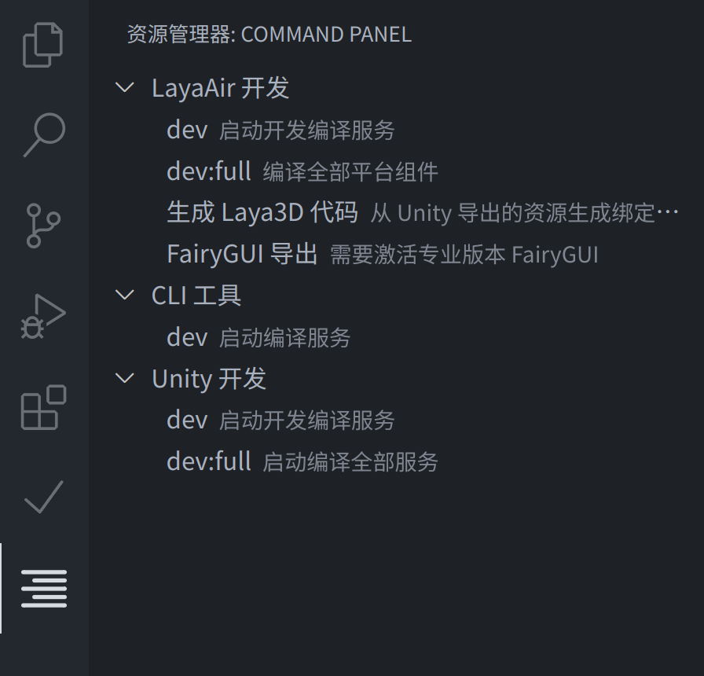

## Run commands by one click


This plugin provides a panel for defining a series of common commands that can be executed with one click.
This plugin is activated when the `.vscode/commands.yaml` file exists in your project which is the definition file of your commands.

```typescript
interface ICommand {
	/** Command name, the title displayed in the command palette */
	name: string;
	/** The title of the command execution in terminal panel */
	title?: string;
	/** Command description, hint description after the command name */
	description?: string;
	/** The prompt message when the mouse is hovered */
	tooltip?: string;
	/**
	 * The execution content of the command
	 * When an array given the commands will be executed one by one
	 */
	command?: string | string[];
	/** Subtask list */
	actions?: ICommand[];
}
```

<details>
<summary>Configuration Example</summary>

```yaml
# .vscode/commands.yaml
- name: LayaAir 开发
  actions:
  - name: dev
    description: 启动开发编译服务
    command: yarn concurrently -k "yarn serve" "yarn webpack --config laya/webpack.config.js --watch --env esbuild=true entry=develop ws=3102"
  - name: dev:full
    description: 编译全部平台组件
    command: yarn concurrently -k "yarn serve" "yarn webpack --config laya/webpack.config.js --watch --env esbuild=true entry=all ws=3102"
  - name: 生成 Laya3D 代码
    description: 从 Unity 导出的资源生成绑定代码
    command: node tools/bin/cli.js laya laya/laya3d.yaml
  - name: FairyGUI 导出
    description: 需要激活专业版本 FairyGUI
    command: node tools/bin/cli.js fairygui laya

- name: CLI 工具
  actions:
  - name: dev
    description: 启动编译服务
    command: yarn webpack --config tools/webpack.config.js --watch --env esbuild=true target=ES2020

- name: Unity 开发
  actions:
  - name: dev
    description: 启动开发编译服务
    command: yarn concurrently -k "yarn serve" "yarn webpack --config unity/webpack.config.js --watch --env ws=3102 esbuild=true entry=dev"
  - name: dev:full
    description: 启动编译全部服务
    command: yarn concurrently -k "yarn serve" "yarn webpack --config laya/webpack.config.js --watch --env esbuild=true entry=all ws=3102"
```
</details>
